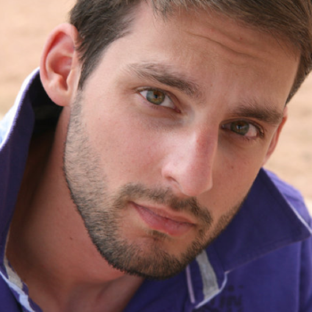

</img>

I'm an independent software architect & developer. I focus on building backend systems with highly scalable and distributed characteristics.

I like to experiment with different programming languages and learn from different paradigms such as imperative and functional. My main proficiency is in C# and .NET and I enjoy using other languages such as Go, F# and Rust even some Elixir from time to time.

When I'm not working, I like to have a fun time with my kids. I really enjoy travelling the world and experiencing new cultures. As of lately I'm also discovering the joys of flying with Microsoft Flight Simulator, and for that I'm building a miniature cockpit, at least with Honeycomb Yoke, Bravo and my own programmed flightdeck on Loupedeck.

  

- 🔭 I’m currently working on [Loupedeck Flight Control Deck](https://github.com/Stephanvs/loupedeck-msfs)
- 🌱 I’m currently learning **Foundation of Functional Programming**
- 👨‍💻 All of my projects are available at [https://stephanvs.com/projects](https://stephanvs.com/projects)
- 📝 I regulary write articles on [https://stephanvs.com/blog](https://stephanvs.com/blog)
- 💬 Ask me about **μServices, Architecture, Functional Programming**
- 📫 How to reach me **stephan@hayman.io**
- ⚡ Fun fact **I wrote an OS kernel once**
