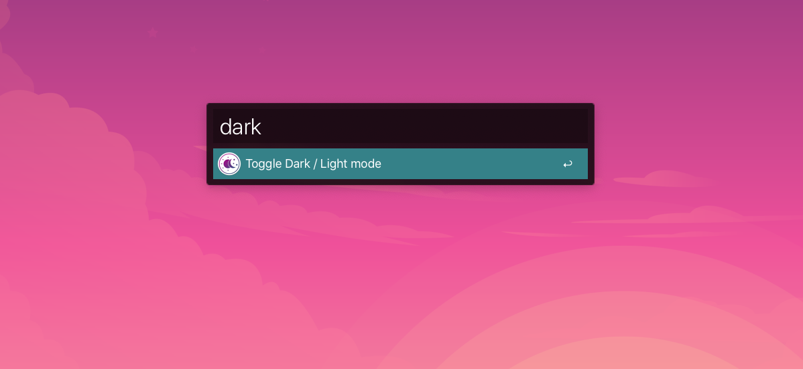

Since macOS Mojave there's support for light and dark mode. It's even possible to automatically toggle it based on sunrise and sunset schedule, or custom times.

However sometimes I just prefer one over the other based on specific factors such as direct sunlight, mood or other touchy feely reasons. It's clumsy to manually open Preferences and click on all the options and I generally prefer an option from the command line.

This is a tiny custom AppleScript that does just that.

### AppleScript to toggle light/dark mode

```shell
osascript -e 'tell app "System Events" to tell appearance preferences to set dark mode to not dark mode'
```

With this script we can do other interesting stuff, such as creating an alias or creating a custom 'workflow' for another app such as [Alfred](https://www.alfredapp.com/), which is exaclty what I did. So, now I can toggle between dark/light mode by just opening Alfred and typing 'dark'.



So, now come over to the dark side! :)

HTH,

Stephan.
